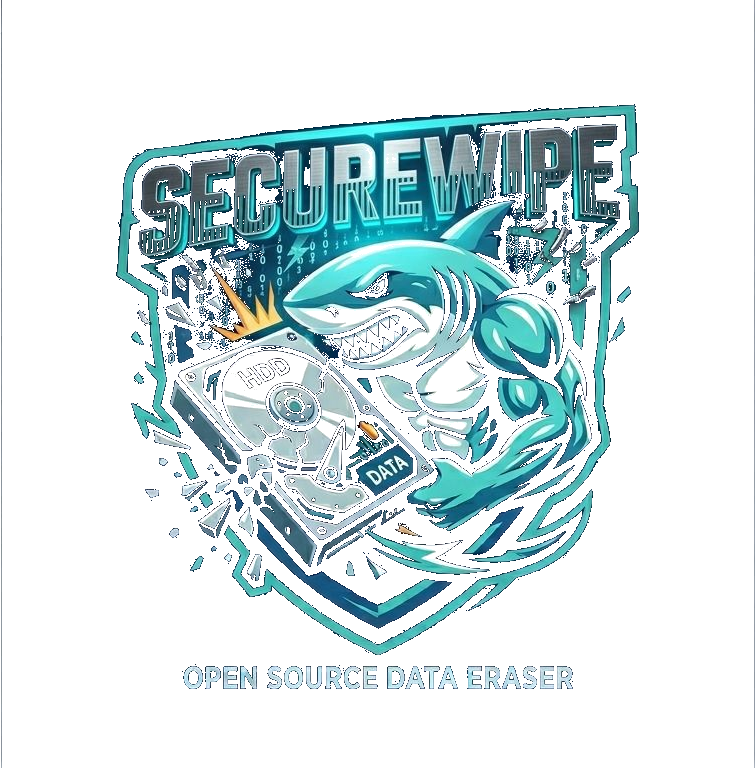

<div align="center">



# SecureWipe

**FR [Français](#français) | EN [English](#english)**

[](https://www.gnu.org/licenses/gpl-3.0)
[](https://www.python.org/)
[]()
[]()
[]()

</div>

---

## Français

### À propos

SecureWipe est un outil open source d'effacement sécurisé de supports de stockage, développé par **[Grujowmi](mailto:grujowmi@proton.me)**.

Né d'un besoin concret en environnement professionnel (établissement de santé soumis aux exigences HDS, NIS2 et RGPD), SecureWipe répond à une question simple : comment effacer un disque dur de façon **irréversible**, **traçable** et **conforme aux référentiels de sécurité** reconnus, sans dépendre d'un outil propriétaire coûteux ?

Le programme détecte automatiquement le type de support (HDD, SSD, NVMe), propose la méthode d'effacement adaptée, et génère un **certificat PDF horodaté** avec filigrane et QR code d'intégrité — prêt pour un audit ou un dossier de conformité.

Conforme **ANSSI Palier 1/2** et **NIST SP 800-88 Rev.2**. Licence **GPL v3**.

---

### Fonctionnalités

- Détection automatique des supports : HDD / SSD / NVMe, modèle, numéro de série
- Détection du chiffrement : LUKS, BitLocker, SED → Crypto Erase proposé en priorité
- Modes d'effacement conformes :
  - ANSSI Palier 1 (1 passe zéros)
  - ANSSI Palier 2 / NIST Clear (1 passe aléatoire + vérification)
  - NIST Purge (ATA Secure Erase / NVMe Format firmware)
  - Crypto Erase (LUKS, BitLocker, SED)
  - Custom (2-7 passes, HDD uniquement)
- Protections : blocage disque système, NIST Purge désactivé sur USB/amovible
- Barre de progression temps réel (MB/s + ETA)
- Vérification post-effacement par échantillonnage (10% par défaut)
- Certificat PDF : logo, filigrane anti-falsification, QR code SHA-256, horodatage
- Log brut .txt en complément du PDF
- Bilingue FR/EN avec détection automatique de la locale
- Multi-disques : plusieurs supports dans la même session

---

### Prérequis

- Python 3.10+
- Linux ou Windows 10/11
- Dépendances Python (voir `requirements.txt`) :
  - `rich`, `reportlab`, `qrcode[pil]`, `Pillow`, `psutil`
  - `customtkinter` — requis pour l'interface graphique (GUI)

---

### Installation

#### Linux

```bash
git clone https://github.com/Grujowmi/SecureWipe.git
cd SecureWipe
sudo bash install.sh
```

#### Windows

```powershell
git clone https://github.com/Grujowmi/SecureWipe.git
cd SecureWipe
# Clic droit sur install.ps1 -> Executer en tant qu'administrateur
# Ou depuis PowerShell admin :
Set-ExecutionPolicy Bypass -Scope Process -Force
.\install.ps1
```

---

### Utilisation

#### Linux

```bash
# Lancement (choix GUI ou CLI au démarrage)
sudo python3 securewipe.py

# Forcer le GUI
sudo python3 securewipe.py --gui

# Forcer le mode terminal
sudo python3 securewipe.py --cli

# Mode test — fichier image comme faux disque (WSL, VM, etc.)
dd if=/dev/urandom of=/tmp/testdisk.img bs=1M count=200
sudo python3 securewipe.py --test-disk /tmp/testdisk.img

# Mode mock — disques fictifs pour tester l'interface
sudo python3 securewipe.py --mock

# Aide
python3 securewipe.py --help
```

#### Windows

```powershell
# Depuis PowerShell en tant qu'Administrateur
# (choix GUI ou CLI au démarrage)
python securewipe.py

# Forcer le GUI
python securewipe.py --gui

# Forcer le mode terminal
python securewipe.py --cli

# Mode mock
python securewipe.py --mock
```

---

### Conformité

| Référentiel | Méthode | Support |
|-------------|---------|---------|
| ANSSI Palier 1 | 1 passe zéros | HDD |
| ANSSI Palier 2 | 1 passe aléatoire + vérification | HDD |
| NIST SP 800-88 Clear | 1 passe aléatoire | HDD |
| NIST SP 800-88 Purge | ATA Secure Erase / NVMe Format | HDD + SSD + NVMe |
| NIST SP 800-88 Purge | Crypto Erase (clé détruite) | LUKS / BitLocker / SED |

> SSD/NVMe : la réécriture par passes est inefficace à cause du wear-leveling.
> SecureWipe bloque automatiquement ces méthodes et propose uniquement les méthodes adaptées.

---

### Structure du projet

```
SecureWipe/
├── securewipe.py
├── install.sh
├── install.ps1
├── requirements.txt
├── CHANGELOG.md
├── core/
│   ├── i18n.py
│   ├── ui.py
│   ├── disk_linux.py
│   ├── disk_windows.py
│   ├── crypto_detect.py
│   └── wipe_engine.py
├── cert/
│   ├── generator.py
│   └── template/logo.png
└── i18n/
    ├── fr.json
    └── en.json
```

---

---

> *Pensé par l'homme, développé par l'homme, aidé par l'IA.*

### Licence

GPL v3 — Copyright (C) 2026 Grujowmi <grujowmi@proton.me>

Ce logiciel est fourni sans garantie. L'utilisateur est responsable de l'utilisation
conforme aux réglementations applicables (RGPD, HDS, NIS2...).

---
---

## English

### About

SecureWipe is an open source secure disk erasure tool, developed by **[Grujowmi](mailto:grujowmi@proton.me)**.

Born from a real-world need in a professional healthcare environment (subject to HDS, NIS2 and GDPR requirements), SecureWipe answers a simple question: how to wipe a hard drive in an **irreversible**, **traceable** and **standards-compliant** way, without relying on an expensive proprietary tool?

The program automatically detects the storage type (HDD, SSD, NVMe), suggests the appropriate wipe method, and generates a **timestamped PDF certificate** with watermark and integrity QR code — ready for an audit or compliance file.

Compliant with **ANSSI Level 1/2** and **NIST SP 800-88 Rev.2**. Licensed under **GPL v3**.

---

### Features

- Automatic detection: HDD / SSD / NVMe, model, serial number
- Encryption detection: LUKS, BitLocker, SED → Crypto Erase offered first
- Compliant wipe modes:
  - ANSSI Level 1 (1 zero pass)
  - ANSSI Level 2 / NIST Clear (1 random pass + verification)
  - NIST Purge (ATA Secure Erase / NVMe Format firmware)
  - Crypto Erase (LUKS, BitLocker, SED)
  - Custom (2-7 passes, HDD only)
- Protections: system disk blocked, NIST Purge disabled on USB/removable
- Real-time progress bar (MB/s + ETA)
- Post-wipe verification by random sampling (10% by default)
- PDF certificate: logo, anti-falsification watermark, SHA-256 QR code, timestamp
- Raw .txt log alongside the PDF
- Bilingual FR/EN with automatic locale detection
- Multi-disk session: multiple drives in one session

---

### Requirements

- Python 3.10+
- Linux or Windows 10/11
- Python dependencies (see `requirements.txt`) :
  - `rich`, `reportlab`, `qrcode[pil]`, `Pillow`, `psutil`
  - `customtkinter` — required for the graphical interface (GUI)

---

### Installation

#### Linux

```bash
git clone https://github.com/Grujowmi/SecureWipe.git
cd SecureWipe
sudo bash install.sh
```

#### Windows

```powershell
git clone https://github.com/Grujowmi/SecureWipe.git
cd SecureWipe
# Right-click install.ps1 -> Run as administrator
# Or from an admin PowerShell:
Set-ExecutionPolicy Bypass -Scope Process -Force
.\install.ps1
```

---

### Usage

#### Linux

```bash
# Launch (choose GUI or CLI at startup)
sudo python3 securewipe.py

# Force GUI
sudo python3 securewipe.py --gui

# Force terminal mode
sudo python3 securewipe.py --cli

# Test mode — use a file image as a fake disk (WSL, VM, etc.)
dd if=/dev/urandom of=/tmp/testdisk.img bs=1M count=200
sudo python3 securewipe.py --test-disk /tmp/testdisk.img

# Mock mode — fictional disks to test the UI
sudo python3 securewipe.py --mock

# Help
python3 securewipe.py --help
```

#### Windows

```powershell
# From PowerShell as Administrator
# (choose GUI or CLI at startup)
python securewipe.py

# Force GUI
python securewipe.py --gui

# Force terminal mode
python securewipe.py --cli

# Mock mode
python securewipe.py --mock
```

---

### Compliance

| Standard | Method | Media |
|----------|--------|-------|
| ANSSI Level 1 | 1 zero pass | HDD |
| ANSSI Level 2 | 1 random pass + verification | HDD |
| NIST SP 800-88 Clear | 1 random pass | HDD |
| NIST SP 800-88 Purge | ATA Secure Erase / NVMe Format | HDD + SSD + NVMe |
| NIST SP 800-88 Purge | Crypto Erase (key destroyed) | LUKS / BitLocker / SED |

> SSD/NVMe: overwrite passes are ineffective due to wear-leveling.
> SecureWipe automatically blocks these methods and only offers firmware-level or crypto erase options.

---

---

> *Thought by a human, developed by a human, assisted by AI.*

### License

GPL v3 — Copyright (C) 2026 Grujowmi <grujowmi@proton.me>

This software is provided without warranty. The user is responsible for ensuring
use complies with applicable regulations (GDPR, HDS, NIS2...).
